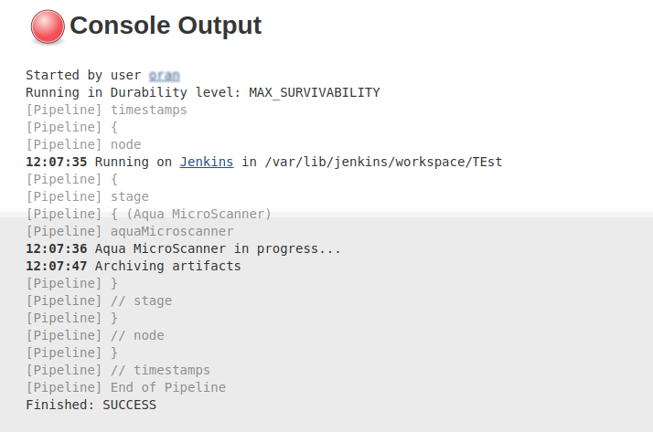
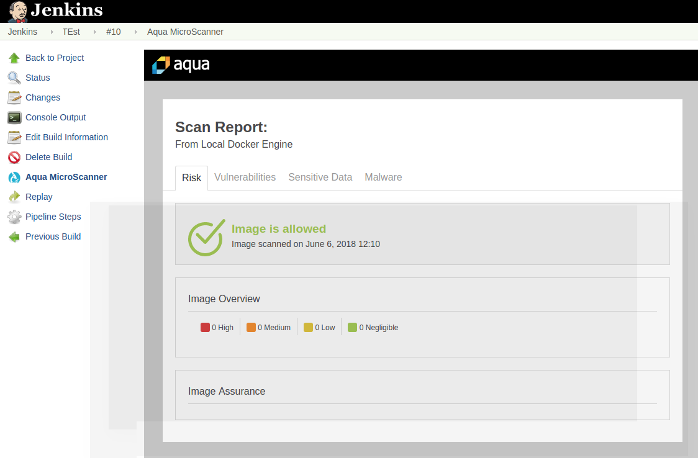

# Aqua Jenkins MicroScanner Plugin #
Enables scanning of docker builds in Jenkins for OS package vulnerabilities.

## Prerequisites for the plugin to be operational ##

1. Docker must be installed on the same machine Jenkins is installed. If your job is configured to use a node other than Master node, then Docker is required only on the build Jenkins node (slave). 
2. The *jenkins* user must be added to the *docker* group so it has permission to run Docker:

     ```
     sudo usermod -aG docker jenkins
     ```
## Install and configure the plugin
 1. In Jenkins, select **Manage Jenkins** and then select **Manage Plugins** from the list. Make sure that the list of available plugins is up to date. 
2. Select the **Available** tab, search for Aqua MicroScanner, and select it.  Click on **Download the Plugin**. This will install the plugin.


3. Follow the instructions [here](https://github.com/aquasecurity/microscanner#registering-for-a-token) to obtain a token to use the microscanner.

4. In Jenkins, select **Manage Jenkins**, then select **Configure System**. Enter the token value.


## Configure HTML in Jenkins

In order to view Aqua scan results in Jenkins, HTML support must be configured. Follow these steps to set this up.

1. In Jenkins, select **Manage Jenkins**, and then open **Script Console**.
2. Verify the current settings:
*System.getProperty("hudson.model.DirectoryBrowserSupport.CSP");*
3. Clear the current settings:
*System.clearProperty("hudson.model.DirectoryBrowserSupport.CSP");*
4. Add settings to allow running scripts and styles from other files served by Jenkins:
```
*System.setProperty("hudson.model.DirectoryBrowserSupport.CSP", "sandbox allow-scripts; default-src 'self'; script-src 'self' 'unsafe-inline'; img-src 'self'; style-src * 'unsafe-inline'; font-src *");*
```
5. This setting will be effective until the next Jenkins reboot. You can add it permanently in any of the following ways:

   a. Create a job that runs this setting every time Jenkins reboots
   ```  
      java -Dhudson.model.DirectoryBrowserSupport.CSP="sandbox allow-scripts; default-src 'self'; script-src 'self' 'unsafe-inline'; img-src 'self'; style-src * 'unsafe-inline'; font-src *;" -jar jenkins.war
   ```
   b. Add the following to the JENKINS_JAVA_OPTIONS file (CentOS: /etc/sysconfig/Jenkins, Ubuntu: /etc/default/Jenkins)
   ```
      JENKINS_JAVA_OPTIONS="-Djava.awt.headless=true -Dhudson.model.DirectoryBrowserSupport.CSP=\"sandbox allow-scripts; default-src 'self'; script-src 'self' 'unsafe-inline'; img-src 'self'; style-src * 'unsafe-inline'; font-src *;\""```
## Use the plugin
You can use the MicroScanner plugin in the build process in Freestyle and Pipelines jobs. You can configure the job to scan the image during the build process.

### Freestyle jobs

In Freestyle jobs add a build step to scan the image with the Aqua MicroScanner, as part of the job configuration. 
1. In Jenkins, in the **Configure** page for a job, click **Add Build Step**.
1. Select Aqua MicroScanner.


3. Select the action to be taken when high severity vulnerabilities are found in the build. You can optionally include a shell command.

4. Enter the image name.

### Pipeline jobs
In Pipeline jobs, the build step to scan the image with the MicroScanner  is included in a pipeline script, as part of the job configuration.

1. In Jenkins, in the **Configure **page for a job, scroll to the **Pipeline **section.
1. Add the a snippet such as the following to the pipeline script, to include a step to scan the image. 


3. Alternatively, you can use the Snippet Generator to create the snippet.


## Plugin Output

You can see the results of the scan in the Console Output.



You can also see results of the scan as an HTML page. An artifact named "scanout.html" will be created in the project's workspace. In the Jenkins build menu, select Aqua MicroScanner, and then select the job whose results you wish to see.




## Build the plugin (instructions for Ubuntu)

* If JDK 7 is not installed, install it
```
     sudo apt-get update
     sudo apt-get install openjdk-7-jdk
```

* Install Maven3 (must be 3)
  *   On Ubuntu 14.04
      ```
      sudo add-apt-repository ppa:natecarlson/maven3
      sudo apt-get update
      sudo apt-get install maven3
      sudo ln -s /usr/bin/mvn3 /usr/bin/mvn
	  ```
  *   On Ubuntu 15.10
      ```
      sudo apt-get update
      sudo apt-get install maven
      ```

*  Build

   When in the root directory, where *pom.xml* resides:
```
     mvn package
```
   **Note**: the first time this command is invoked, many downloads will occur and it will take quite some time.

## Install manually ##
Copy the *target/aqua-docker-scanner.hpi* file to *$JENKINS/plugins/* where *JENKINS* is the Jenkins root directory, by default it is */var/lib/jenkins/*.

Restart Jenkins:
```
     sudo /etc/init.d/jenkins restart
```

## Publicly release a new version to jenkins-ci.org ##
See https://wiki.jenkins-ci.org/display/JENKINS/Hosting+Plugins#HostingPlugins-Releasingtojenkinsci.org. It describes several alternatives; use the following:

1. If not already done, create a *settings.xml* file with your credentials as described
2. Execute and accept defaults for prompts :
```
    mvn release:prepare release:perform
````
